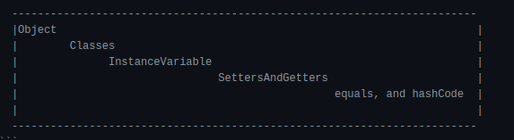
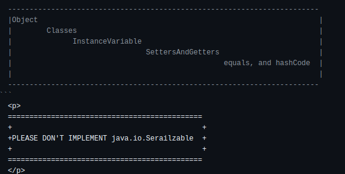
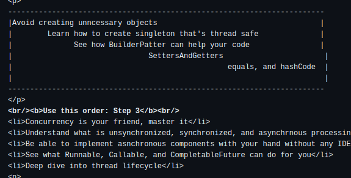
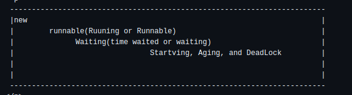
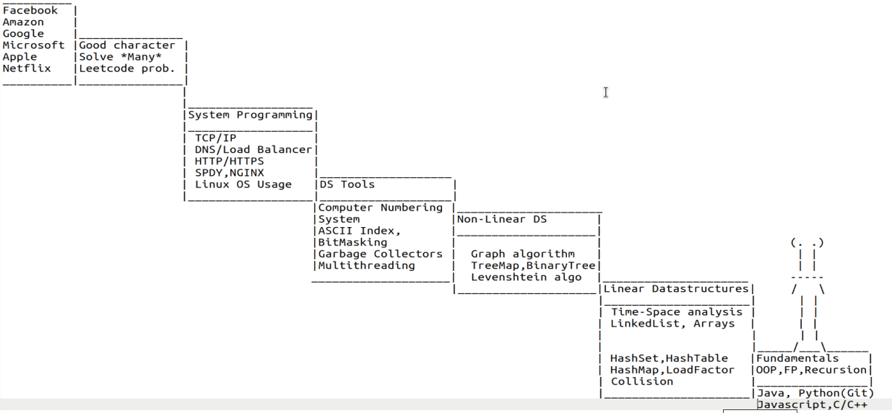

 
  <b>Things you need to master</b> 

  <b>Use this order: Step 1</b>
  <li>Know how to work with a PC to a basic extent</li>
  <li>Download any text editor of your choice</li> 
  <li>Start with OOP</li> 

 

  

  <li>Know what is an Object, and how it should be implemented</li> 
  <li>You should be able to model an object in a blue print</li> 
  <li>Comfortably run your code from the CMD</li> 
  <li>Know the difference between int and Integer, long, and Long</li> 
  <li>Understand what when to use linear, and non-linear data-strucutres</li> 
  <li>Deep dive into hashing, load factor, and collition</li> 
  <li>When and how to recurse is your best bet, so know if</li> 
  <li>Play with HashMap, TreeMap, HashSet, TreeSet, SinglyLinkedList, and DoubltLinkedList</li> 
   <b>Use this order: Step 2</b> 
  <li>Dive into unit testing via JUnit</li>
  <li>Test coverage is important, so consider Jacoco</li> 
  <li>You will need external or third party dependency, so setup Maven on your machine</li> 

   <b>Use this order: Step 3</b> 
  <li>Concurrency is your friend, master it</li>
  <li>Understand what is unsynchronized, synchronized, and asynchrnous processing</li> 
  <li>Be able to implement asnchronous components with your hand without any IDE</li> 
  <li>See what Runnable, Callable, and CompletableFuture can do for you</li> 
  <li>Deep dive into thread lifecycle</li> 
  

   <b>Use this order: Step 4</b> 
  <li>Play around with servlet, and build a toy project with it</li>
  <li>Know what http headers are, and how they work</li> 
  <li>Avoid repetitive call, so understand what cookies, and caches are</li> 
  <li>You need a database, go for the simplest(MySQL)</li> 

   <b>Use this order: Step 5</b> 
  <li>With your hand, know how to create a database table</li>
  <li>Database indexing is your best friend, know how it should be implemented, and the need for it</li> 
  <li>Joining works, understand {INNER JOIN, LEFT JOIN, RIGHT JOIN, OURTER JOIN}</li> 
  <li>Key is the foundation, know the difference between {Primary, Foreign, Unique, and Composite Keys}</li> 
  <li>It must be viewed, it it's too complex. Know to use {View} to simplify database complexity</li> 
  <li>Agrregate function is needed. Learn how they work, when and why it should be considered.</li> 

   <b>Use this order: Step 6</b> 
  <li>As it grows big, learn how to divide it into smaller chunks</li>
  <li>Deep dive into microservice</li> 
  <li>You need an intermediary, so learn how to create an API gateway from scratch using Jakarta EE. Don't use Spring yet</li> 
  <li>When it's down, you wo't know, so learn how to implemente a service discovery from scratch</li> 
  
   <b>Use this order: Step 7</b> 
  <li>Your friends and family need to see it.</li>
  <li>Start with a VPS server, and learn how to deploy your product</li> 
  <li>Anybody, and everybody shouldn't be able to access some resources, see how firewall rules can help</li> 

   <b>Use this order: Step 8</b> 
  <li>Your server is powerful beyond how you see it.</li>
  <li>Figure out how to connect your server with Github, and how to have many of it running with just once code </li> 
  
  
   <b>Use this order: Step 9</b> 
  <li>Are you sure of where your users are coming from?</li>
  <li>Learn about vertical and horizontal scaling </li> 
  
   <b>Use this order: Step 10</b> 
  <li>Your code would have grown big, see if SOAP or REST is your best bet</li>
  <li>If it's not secure, it's not secure. You need to know if session based or token based authentication fit your needs </li> 
  
  
   <b>Use this order: Step 11</b> 
  <li>Does it stop working?</li>
  <li>ping, and then telenet the ip and port  </li> 
  <li>You want to have a good sleep, use ELK for logging</li> 
  
   
Find it useful? More is coming
 
  

 

 
<b>How you should master it.</b>

